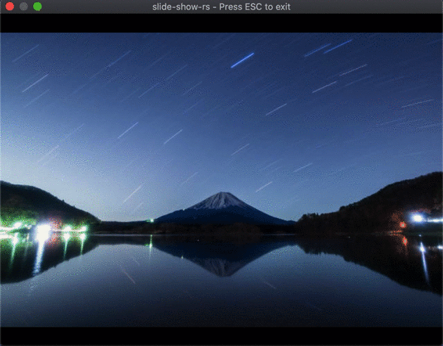

# slide-show-rs


Show images continuously like:



## Usage

Before compiling, make sure that your window size is defined in `.env` file. For example,

```text
WINDOW_WIDTH=1920
WINDOW_HEIGHT=1080
```

To reduce preprocessing time, use `--release` option. It makes this program much faster.

```bash
cargo run --release
```

By default, this app shows all images in `photo/` directory. If you want to replace it, please give the app directory path as an argument like `cargo run --release photo/test`.

If you got error(s), please confirm support status of minifb crate ([repo](https://github.com/emoon/rust_minifb)).

### Speed

The default speed is 0.5s, that is, shown image is changed if 5.0s passes.
To change this speed, please input key :arrow_up: or :arrow_right: to increase speed by 0.5s, input key :arrow_down: or :arrow_left: to decrease speed by 0.5s.

Note that real speed is affected by your machine spec.

## Test

In many cases such as this repo's GitHub Actions, `cargo test` is enough.

But, if you got `NSInternalInconsistencyException` (macOS) and failed to test, test **must** be run with `--test_threads=1` option.
That is, run `cargo test -- --test-threads=1`.

### Formatter

Use clippy and rustfmt before committing changes.

```bash
cargo clippy
cargo fmt
```

## Links

The idea of image viewer comes from:

- [rust_minifb image example](https://github.com/emoon/rust_minifb/blob/master/examples/image.rs)
- [Issue in rust_minifb repo](https://github.com/emoon/rust_minifb/issues/48)
